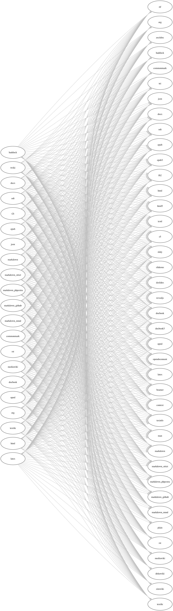
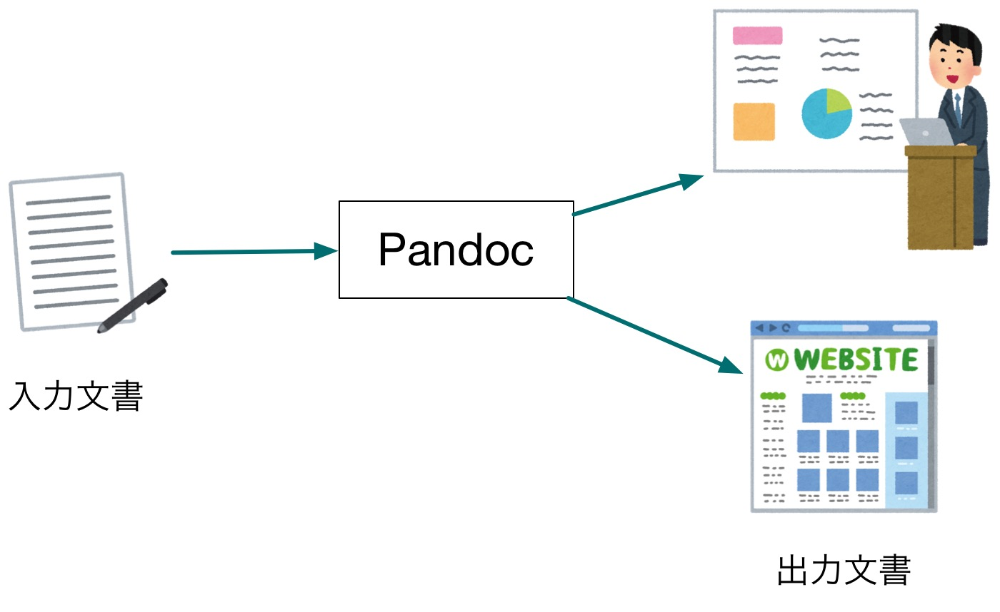

---
title: 書式の自由が社会を変える―LibreOfficeとPandocができること
author: 藤原 由来
date: 2017年4月29日
revealjs-url: reveal.js-3.4.0
theme: sky-sky-y
transition: fade
transitionSpeed: fast
slideNumber: true
history: true
margin: 0
...

----

# 自己紹介

- 名前
    - 藤原 由来 (本名, [GitHub](https://github.com/sky-y))
    - 藤原 惟（[ブログ](http://www.3rd-p-zombie.net/)）
    - すかいゆき（[Twitter](https://twitter.com/sky_y)）
- 職業
    - フリープログラマ
    - 専門学校 非常勤講師

----

# Pandocに関する活動

- Qiitaを中心に記事執筆
    - [多様なフォーマットに対応！ドキュメント変換ツールPandocを知ろう - Qiita](http://qiita.com/sky_y/items/80bcd0f353ef5b8980ee)
- Pandocユーザーズガイドを和訳
    - [Pandoc ユーザーズガイド 日本語版](http://sky-y.github.io/site-pandoc-jp/users-guide/)
    - バージョンが古くなったので、改訂を予定
- 日本Pandocユーザ会
    - 最近Slack作りました: [Slack登録フォーム](https://docs.google.com/forms/d/e/1FAIpQLScdXINuMSFlKFk9YClkDUtvZNaYFWVSiJyleYjtMVbIHqwJhA/viewform)

----

# Pandoc公式サイト

- [Pandoc - About pandoc](http://pandoc.org/index.html)
- ユーザーズガイド
    - [Pandoc - Pandoc User’s Guide](http://pandoc.org/MANUAL.html)
    - [Pandoc ユーザーズガイド 日本語版](http://sky-y.github.io/site-pandoc-jp/users-guide/)

----

# Pandocと私

- 院生時代の依頼
    - 従来よりLaTeXで書かれた「教育用システムの利用手引」を、EPUBにできるかどうか検証してくれないか？
    - このとき調べ回って、「Pandocというものがあるらしい」と気づいた
- 「LaTeXからEPUBに変換する」タスクが想像以上にあっさり実現
    - 多少は難はあったが（input命令に当時は対応してない（今は対応）とか、組版がいけてないとか）
    - この感動が、今の活動の原点
- なんでこんなにすごいソフトウェアが、日本では知られていなかったんだろう？
    - 「Pandocを広めよう」と決意した瞬間

----

# この発表の概要


- Pandocでドキュメントを変換しよう
    - Markdown→LibreOffice Writer
    - LibreOffice Writer→Markdown

----

# Markdownって何？

- このスライド自体が、実はMarkdownで書かれています
- 元々は[John Gruberが作ったオリジナルの処理系](http://daringfireball.net/) でHTMLに変換するための略記法だった
- そのうちGitHubやPHPなどで記法が拡張された
    - MultiMarkdownやPandocの登場をきっかけに、目的も「論文」「プレゼンテーション」「電子書籍」など用途が広がった
    - 数々の「方言」がある状態
- 基本のMarkdownだけを覚えれば、大抵は書けます
    - プレビューを行うのが鉄則

----

# こんなことに困っていませんか？

- Writerが重いのでテキストファイルで下書きしたい
- バージョン管理をしたいけど、Writer文書は`git diff`が取りにくい
- Writer文書をHTMLに変換せよとお達しがあった
- Writer文書をSphinx(reST)で使いたい
- Markdownなどでスライドショーを作りたい

----

# Pandocの魅力

----

# Pandocとは

- [Pandoc - About pandoc](http://pandoc.org/index.html)
- 文書変換ツール
    - あるフォーマットで書かれた文書を、別のフォーマットに変換するツール
- Pandocの特徴は、対応フォーマットが非常に多いこと

----

[{ width=15% }](http://pandoc.org/diagram.jpg)

----

# 対応フォーマット（一部省略）

- 入力
    -  **Markdown** (Pandoc, CommonMark, PHP Markdown Extra, GitHub-Flavored Markdown, MultiMarkdown)
    - (subsets of) Textile, **reStructuredText, HTML, LaTeX, MediaWiki markup**, Emacs Org mode
    - OPML, DocBook, EPUB, **ODT** and Word docx
- 出力
    - 入力フォーマットのほとんど（ODT含む）
    - **Markdown**
    - manページ,  AsciiDoc, InDesign ICML
    - **プレゼンテーション**: LaTeX Beamer, HTML5(reveal.jsなど)
    - PDF (wkhtmltopdfまたはLaTeXエンジンが必要)

----

# Pandocでできないこと

- 表主体の文書を扱うこと
    - Excel, LibreOffice Calc
    - 一部に簡単な表を埋め込むことはできる（HTMLの`<table>`相当）
- LibreOffice Impressに/を変換すること
    - LaTeX Beamer/HTMLプレゼンには変換可能

----

# Pandocを使う心得

- 過剰な期待をし過ぎないこと
    - Pandocは万能でないし、文書仕様の全てを満たしているわけではない
- 補助的に使うのがベスト
    - Pandocで、テキストと大まかな構造を抽出
    - 変換し切れなかった部分を、手作業や自作スクリプトで編集

----

# Pandocの実装

- 言語: Haskell
    - Pandoc的には、「厳密に型が定義されている」ことがありがたい
    - Haskellは構文解析器(パーサ)を作るのにすごく適している (Parsecなど)
- モジュール構成
    - Reader: 入力文書を解析し、Haskell上の中間文書に変換する
    - Writer: 中間文書を受け取り、出力フォーマットに変換する

----



----

# Pandocが扱えるMarkdown方言

- Pandoc's Markdown: `-f markdown`
    - Pandocにおける標準のMarkdown方言
    - 技術文書から論文・電子書籍まで幅広く対応
- GitHub Flavored Markdown (gfm): `-f markdown_github`
    - GitHubの標準、プログラマ・フレンドリーな方言
- PHP Markdown Extra: `-f markdown_phpextra`
    - 最近はMarkdown Extraとも呼ばれる
- MultiMarkdown: `-f markdown_mmd`
    - HTMLだけでなくLaTeXなどの論文も意図した処理系
- CommonMark: `-f commonmark`
    - 仕様の曖昧さをなくすことを目的とした仕様/処理系
    - ここ最近は、事実上の標準に近づく（公式な標準ではない）

----

# 補足: Markdownと標準仕様

- RFC
    - [RFC 7763 - The text/markdown Media Type](https://tools.ietf.org/html/rfc7763)
    - [RFC 7764 - Guidance on Markdown: Design Philosophies, Stability Strategies, and Select Registrations](https://tools.ietf.org/html/rfc7764)
- RFCでも方言は統一できなかった
    - 代わりに、Media Typeにて「Markdownであること」と「方言の名前」を明示する方法を定めた
    - 参考: <http://tk0miya.hatenablog.com/entry/2016/12/30/205418>

----

# 準備: Pandocをインストールする

----

# ターミナルを開く

- Mac: ターミナル.app or iTerm2
- Windows: (今回は)コマンドプロンプト
    - (分かっている方は)お好きなターミナルでも結構です
- Linux: お好きなターミナル

----

# Pandocのインストール: パッケージマネージャ編

- 原則として、Haskell処理系は不要です
- Mac([Homebrew](http://brew.sh/index_ja.html))
    - `$ brew install pandoc`
- Windows([Chocolatey](https://chocolatey.org/))
    - `> cinst -y pandoc`
- Linux
    - バージョンが古いことがあるので注意
    - Debian: `$ sudo apt-get install pandoc`
    - CentOS: [pandocをCentOS7にインストール - Qiita](http://qiita.com/fk_2000/items/2ea57ea36b523c0cae5a) を参照
    - ソースコード: [Stack](https://docs.haskellstack.org/en/stable/README/)(Haskellビルドツール)が必要
        - [GitHub - jgm/pandoc: Universal markup converter](https://github.com/jgm/pandoc)

----

# Pandocのインストール: インストーラ編

- パッケージを直接落としてインストール
    1. [ここからパッケージをダウンロード](https://github.com/jgm/pandoc/releases/latest)
        - Windows: `.msi`, Mac: `.pkg`
    2. インストール

----

# wkhtmltopdfのインストール

- PDF出力のために必要
    - TeXLive/MacTeXを入れていれば、LaTeX処理系も利用可能（説明略）
    - ただし、pLaTeXはNGなので、LuaLaTeX/XeLaTeXのみ 
- パッケージマネージャでインストール
    - Mac: `$ brew cask install wkhtmltopdf`
        - Caskの方なので注意
    - Windows: `> cinst -y wkhtmltopdf`
    - Debian: `$ sudo apt-get install wkhtmltopdf`
- パッケージを直接落としてインストール
    1. [wkhtmltopdf - Downloads](http://wkhtmltopdf.org/downloads.html)からダウンロード
    2. インストール


----

# 動作確認: Pandoc単体

Bashにて確認（コマンドプロンプトも同様のはず）

```
$ pandoc --version
$ pandoc --list-input-formats
$ pandoc --list-output-formats
$ echo "**Hello**" | pandoc -f markdown -t html
<p><strong>Hello</strong></p>
```

----

# 動作確認: Pandoc + wkhtmltopdf (PDF)

```
$ echo "**Hello**" | pandoc -f markdown -t html5 -o hello.pdf
```

----

# おまけ: Pandocで作れるスライド

- このスライド自体をPandocで生成しました
- 今回は「reveal.js」形式に変換
    - HTML+JavaScriptによるプレゼンテーション
    - クライアントサイドで完結→GitHub Pagesにアップロード可能
- 補足: Pandocでは他のプレゼン形式にも変換できる
    - LaTeX Beamer
    - reveal.js以外のHTMLプレゼン（割愛）

----

# 実際のソースコード

- このスライド自体がGitHub Pagesにアップロードされています
- GitHubリポジトリ: 
    - Markdown (raw): 

----

# Pandocチュートリアル: LibreOffice Writer文書を中心に

----

# これからやること

- LibreOffice Writer

----

# pandocコマンド

```
$ pandoc index.p.md -s -t revealjs -o index.html
```

- `-s`: standalone (ヘッダ付きの完全なファイルを出力)
- `-t`: 出力フォーマット(reveal.js)
- `-o`: 出力ファイル名

----

# ファイルを開く

```
$ open index.html    # Mac/Linux
> start index.html   # Windows
```

----

# 「書式の自由」について

----

# Pandocも自由を愛する者の味方です

- LibreOfficeの理念
    - [私たちは誰? | LibreOffice](https://ja.libreoffice.org/about-us/who-are-we/)

> LibreOffice は、ちょうどあなたのように、フリーソフトウェアの原理を信じ、そしてその成果を制限のない形で世界中で共有することを信じるユーザーによって開発されています。

----

# Pandocの思想的インパクト＝「書式の自由」

- 「あらゆる書式は変換できる」というメッセージ
    - 現状、Excelなどは処理できないが・・・
- 真に「書式の自由」がもたらされたとき、何が起こるか？
    - これから理想論を話します

----

# 「書式の自由」がもたらされたとき

- 各々が好きな書式やソフトで文書を作成できる
- それを、目的の書式に変換する
    - 確定申告
    - 事務手続き
    - etc.
- 適切な形式で入力・データベース化・出力できる
    - MS Officeで入力してもいい（もちろんLibreOfficeが嬉しいけど）
    - オープンデータの推進

----

# 「書式の自由」が与える真のインパクト

- 例：「Excel方眼紙（ネ申Excel）」の縛りから人々が解放されたら？
- 「書式の縛り」が生んできた仕事がなくなる→雇用がなくなる
    - いわゆるシンギュラリティの一種？
    - 例：社内の「Excel職人」がお役御免となる
    - その人たちはどうなるのか？

----

# 課題：自由の前提として「肯定」と「居場所」が必要になる

- 「仕事＝プライド」の人は、少なくないらしい
    - そのような人にとって、自由＝「何をしてもいい」という状況は虚しく息苦しい
    - 「自由からの逃走」（エーリッヒ・フロム）は起こりうる
- 「仕事＝プライド」の人を単に非難してはいけない
    - ただ、受け入れること
    - 気軽に寄れる「居場所」をつくること

----

# 最後に

----

# Pandocの今後の課題

- 日本語に特化した文書フォーマットにほとんど対応していない
    - 書籍におけるルビや圏点など
    - 日本語コミュニティの必要性
- 表形式の文書は対応していない
    - Excel文書など→Excel方眼紙への対策には致命的
    - サードパーティのプリプロセッサにより部分的に変換する手段はある
        - 一部の図表（Graphvizなど）はこの方法で取り込むことができる

----

# 日本Pandocユーザ会

- Webサイトはリニューアル予定
- Slackを始めました
    - [Slack登録フォーム](https://docs.google.com/forms/d/e/1FAIpQLScdXINuMSFlKFk9YClkDUtvZNaYFWVSiJyleYjtMVbIHqwJhA/viewform)


----

# Q&A

- 連絡先
    - <sky.y.0079@gmail.com>
    - Twitter: [@sky_y](https://twitter.com/sky_y)